# IBM Blockchain - Open Points Application

Welcome! These instructions describe the prerequisites you should complete before attending the lab session. Please follow these steps to ensure that you are fully 
prepared to participate on the day of the lab.

## Prepare your Bluemix account

<b>1. Ensure that you have an account on [IBM Bluemix](https://bluemix.net). (If you already have an account, you can proceed to step 2 in this section). </b>

  1.1 Register for a [Bluemix account](https://bluemix.net/registration/), fill out the required details and click 'Create Account'.

&nbsp;&nbsp;&nbsp;&nbsp;&nbsp;&nbsp;&nbsp;&nbsp;&nbsp;&nbsp;&nbsp;&nbsp; 

   You will receive a message to check your email.

&nbsp;&nbsp;&nbsp;&nbsp;&nbsp;&nbsp;&nbsp;&nbsp;&nbsp;&nbsp;&nbsp;&nbsp; 

   1.2 Please check your email and look for a registration confirmation email from Bluemix.

&nbsp;&nbsp;&nbsp;&nbsp;&nbsp;&nbsp;&nbsp;&nbsp;&nbsp;&nbsp;&nbsp;&nbsp; 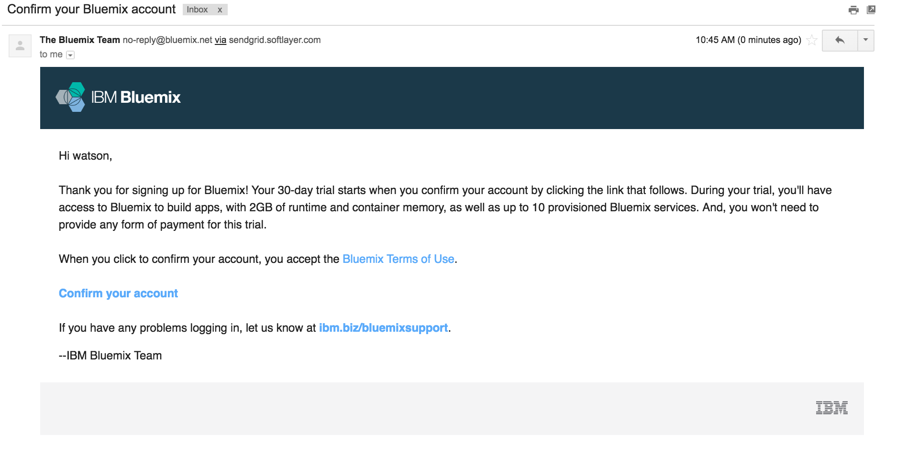

   1.3 Click on 'Confirm your account' and receive a 'Success' message.

&nbsp;&nbsp;&nbsp;&nbsp;&nbsp;&nbsp;&nbsp;&nbsp;&nbsp;&nbsp;&nbsp;&nbsp;  

   1.4 Click 'Login' and login with your Bluemix credentials.

&nbsp;&nbsp;&nbsp;&nbsp;&nbsp;&nbsp;&nbsp;&nbsp;&nbsp;&nbsp;&nbsp;&nbsp;  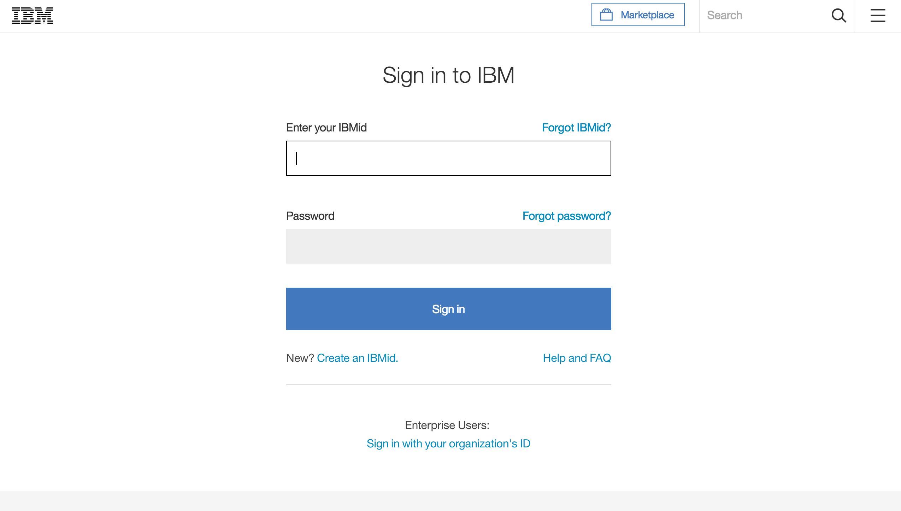
   

   1.5 Create an Organization and enter any organization name.

&nbsp;&nbsp;&nbsp;&nbsp;&nbsp;&nbsp;&nbsp;&nbsp;&nbsp;&nbsp;&nbsp;&nbsp; 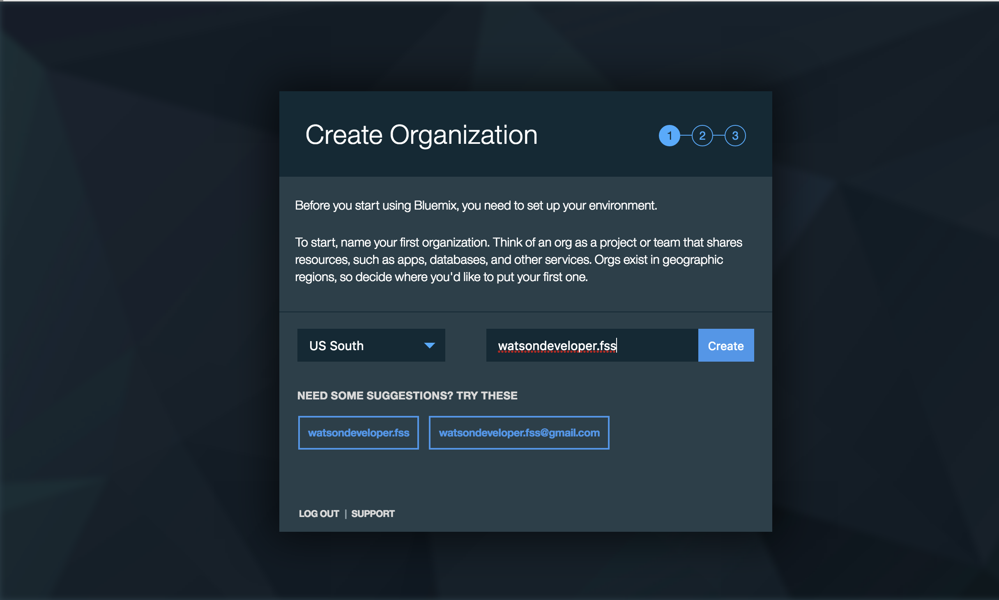

   1.6 Create a Space and enter a space name. You can also choose the default space name of 'dev'.

&nbsp;&nbsp;&nbsp;&nbsp;&nbsp;&nbsp;&nbsp;&nbsp;&nbsp;&nbsp;&nbsp;&nbsp; 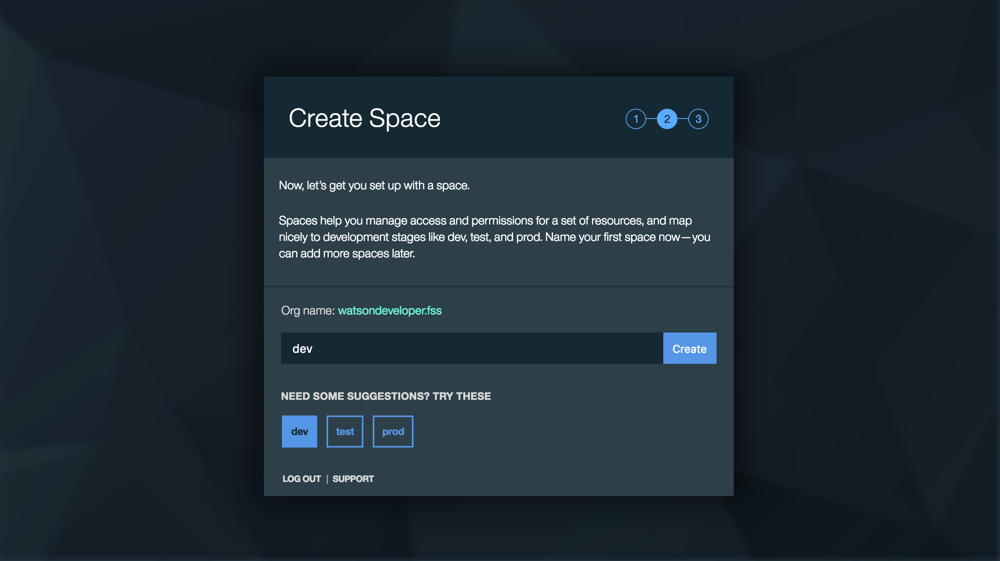
   

   1.7 After you receive a success message, please click 'I'm Ready'

&nbsp;&nbsp;&nbsp;&nbsp;&nbsp;&nbsp;&nbsp;&nbsp;&nbsp;&nbsp;&nbsp;&nbsp; 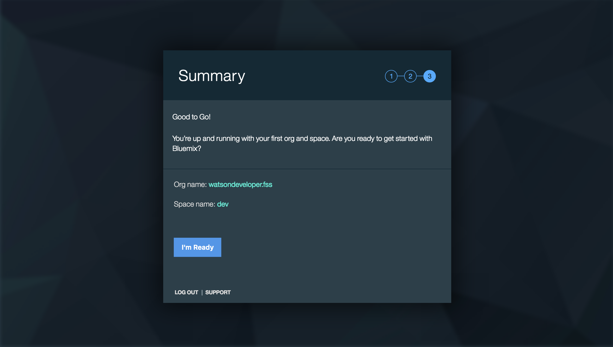
 
<b>
 You will land on your Bluemix Dashboard. 
 * If you have landed on the Dashboard view as shown below, proceed to [step 2](#acc_complete1).
 * If you did not get to the Dashboard, proceed to [step 1.8](#step_view). 
</b>

&nbsp;&nbsp;&nbsp;&nbsp;&nbsp;&nbsp;&nbsp;&nbsp;&nbsp;&nbsp;&nbsp;&nbsp; 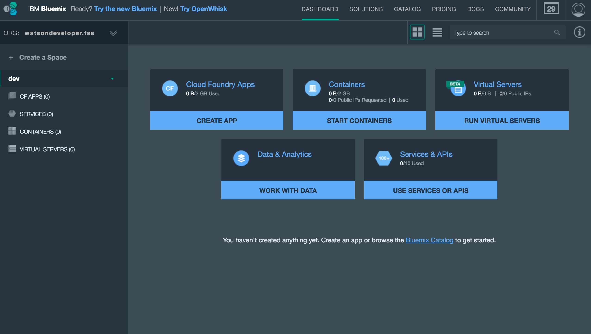

<a name="step_view">
   1.8 If you land on the new Bluemix interface as shown below,</a> click on the highlighted area at the top right.

&nbsp;&nbsp;&nbsp;&nbsp;&nbsp;&nbsp;&nbsp;&nbsp;&nbsp;&nbsp;&nbsp;&nbsp; 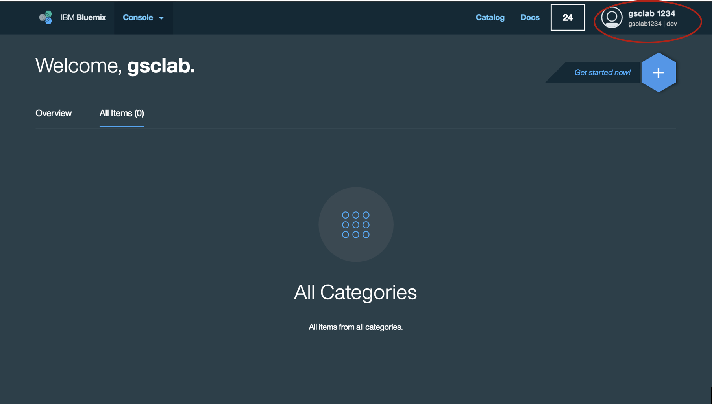   

 Click on 'Switch to Classic'.

&nbsp;&nbsp;&nbsp;&nbsp;&nbsp;&nbsp;&nbsp;&nbsp;&nbsp;&nbsp;&nbsp;&nbsp; 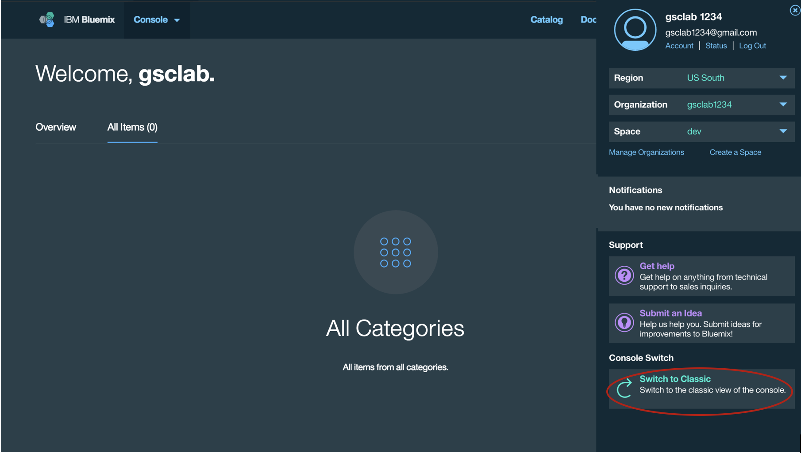  

You may be asked to login again. After login, you will land on the <b>Bluemix Dashboard</b>.

<a name="acc_complete">
<a name="acc_complete1">
<b> 2. Ensure that you have the necessary space available in your Bluemix account to complete the lab. During the lab, you will be required to deploy 1 application and 2 services.  Go to your Bluemix Dashboard to check if you have the required space: </b></a></a>
  
   * The 'Services & APIs' tile shows the number of services you have available. You will require space to deploy two services during the lab. If you do not have sufficient space for two services, then delete some existing services (visible in your dashboard) before proceeding to the next step. 

&nbsp;&nbsp;&nbsp;&nbsp;&nbsp;&nbsp;&nbsp;&nbsp;&nbsp;&nbsp;&nbsp;&nbsp;

   * The 'Cloud Foundry Apps' tile shows the memory you have available for apps. You will require at least 512 MB of free space to deploy an app during the lab. If you do not have 256MB of free space, then delete some existing apps (visible in your dashboard) before proceeding to the next step.

&nbsp;&nbsp;&nbsp;&nbsp;&nbsp;&nbsp;&nbsp;&nbsp;&nbsp;&nbsp;&nbsp;&nbsp;

## Deploy the App

<b>1. Click on the 'Deploy to Bluemix' button below.</b>

&nbsp;&nbsp;&nbsp;&nbsp;&nbsp;&nbsp;&nbsp;&nbsp;&nbsp;&nbsp;&nbsp;&nbsp; 

<b>2. Log in with your Bluemix account.</b>

&nbsp;&nbsp;&nbsp;&nbsp;&nbsp;&nbsp;&nbsp;&nbsp;&nbsp;&nbsp;&nbsp;&nbsp; 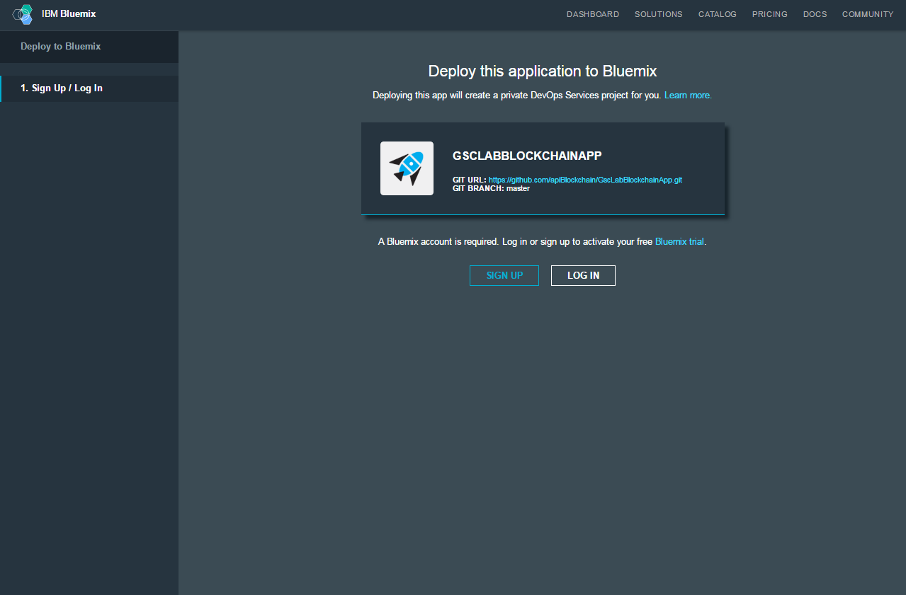

<b>3. If you are asked to choose an alias, then follow these instructions. Otherwise, proceed to step 4 in this section. </b>

3.1 Enter a unique alias name and click create.
&nbsp;&nbsp;&nbsp;&nbsp;&nbsp;&nbsp;&nbsp;&nbsp;&nbsp;&nbsp;&nbsp;&nbsp; 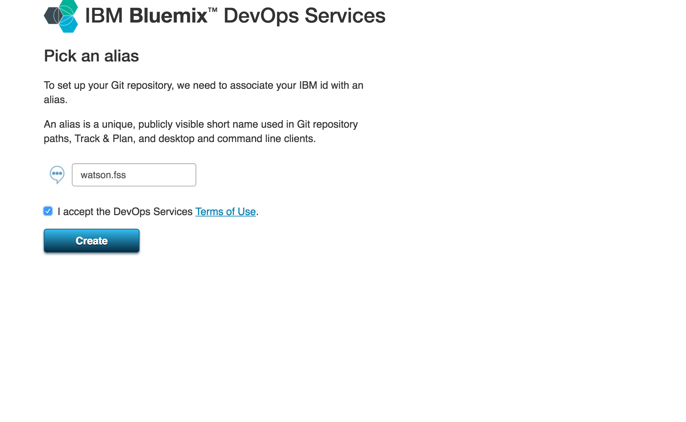

3.2 Verify your alias name and click continue.
&nbsp;&nbsp;&nbsp;&nbsp;&nbsp;&nbsp;&nbsp;&nbsp;&nbsp;&nbsp;&nbsp;&nbsp; 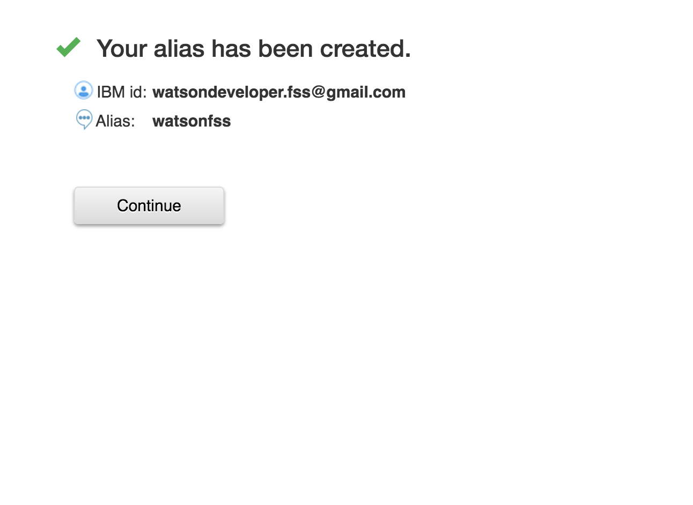

<b>4.  Leave the default app name that Bluemix chooses as is. You may modify the default Organization 
and Space if you would like the app deployed to a specific area of your Bluemix account. Otherwise, accept the default values
and click 'DEPLOY'.</b>

&nbsp;&nbsp;&nbsp;&nbsp;&nbsp;&nbsp;&nbsp;&nbsp;&nbsp;&nbsp;&nbsp;&nbsp; 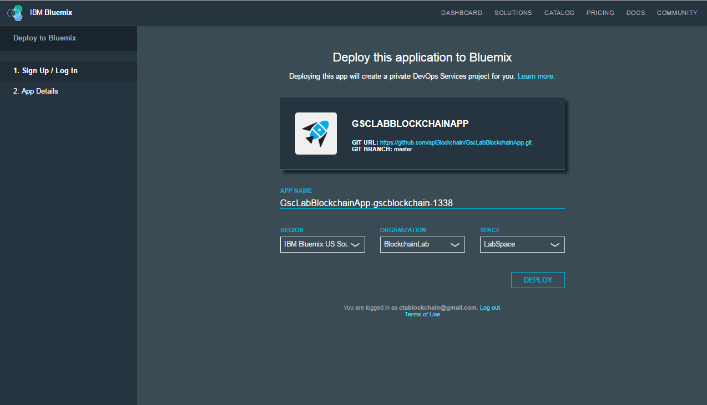

* The status of the deployment is shown. This can take approximately 3-5 minutes to complete.

&nbsp;&nbsp;&nbsp;&nbsp;&nbsp;&nbsp;&nbsp;&nbsp;&nbsp;&nbsp;&nbsp;&nbsp;

* The deployment process performs the following actions:
  - Creates a Node JS application
  - Creates a blockchain service

<b>5. After the deployment has completed, click on the 'Deployed to Bluemix sucessfully' link. </b>

&nbsp;&nbsp;&nbsp;&nbsp;&nbsp;&nbsp;&nbsp;&nbsp;&nbsp;&nbsp;&nbsp;&nbsp;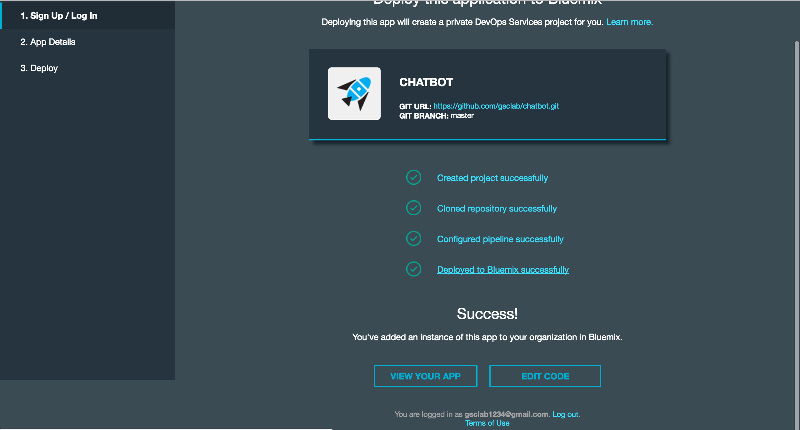

You will land on the Overview page of your application. 

&nbsp;&nbsp;&nbsp;&nbsp;&nbsp;&nbsp;&nbsp;&nbsp;&nbsp;&nbsp;&nbsp;&nbsp;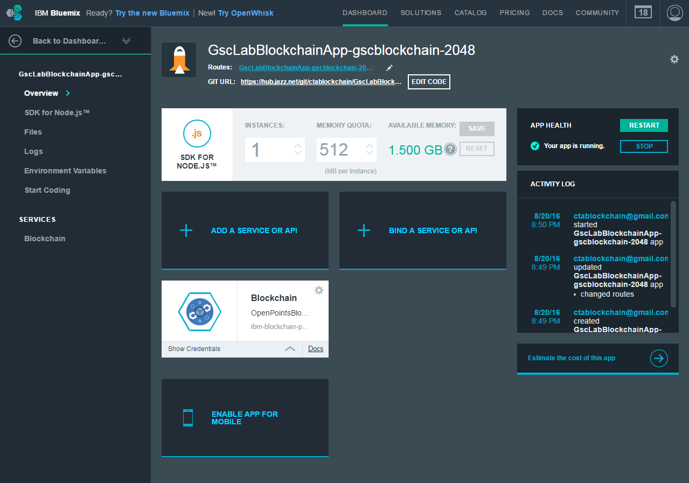

<b>6. Click on the blockchain service tile.</b>

&nbsp;&nbsp;&nbsp;&nbsp;&nbsp;&nbsp;&nbsp;&nbsp;&nbsp;&nbsp;&nbsp;&nbsp;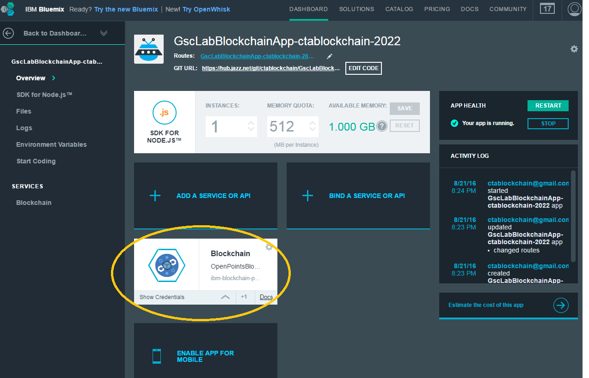

You will land on the Overview page of the blockchain service, which should appear similar to the one shown below.  

&nbsp;&nbsp;&nbsp;&nbsp;&nbsp;&nbsp;&nbsp;&nbsp;&nbsp;&nbsp;&nbsp;&nbsp;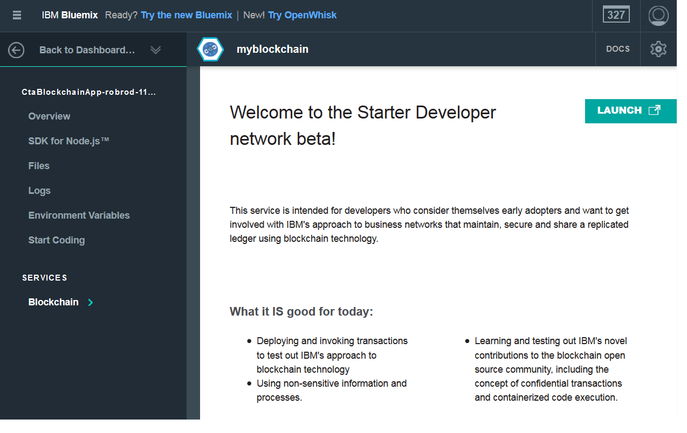

<b>7. The application and services have been successfully deployed, and you are now ready to begin the lab!</b>

# Troubleshooting

If you receive the error message shown below that the network is over capacity, then the service was not created. 
Please delete the blockchain service and the lab application, and repeat the deployment steps listed above until a blockchain
service can be successfully created. 

&nbsp;&nbsp;&nbsp;&nbsp;&nbsp;&nbsp;&nbsp;&nbsp;&nbsp;&nbsp;&nbsp;&nbsp;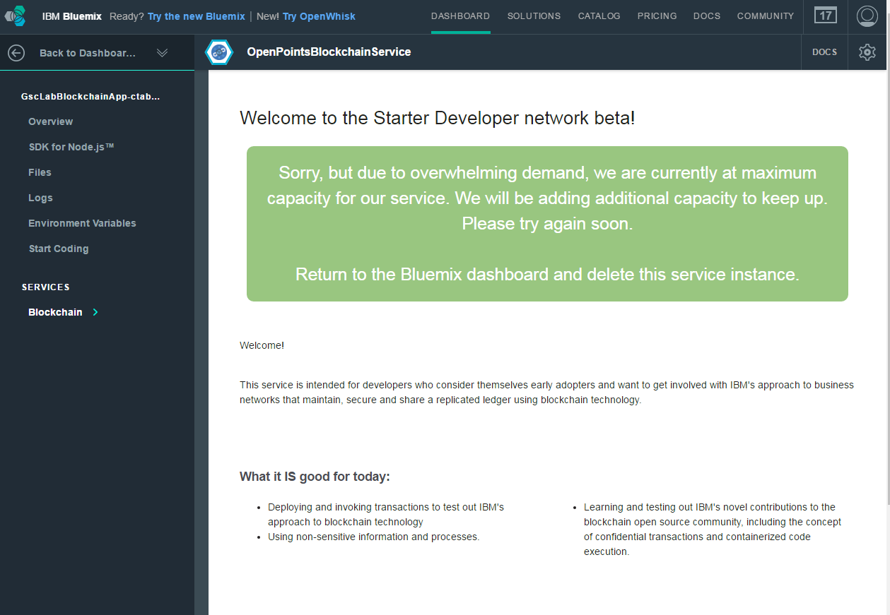

Deleting the service.
&nbsp;&nbsp;&nbsp;&nbsp;&nbsp;&nbsp;&nbsp;&nbsp;&nbsp;&nbsp;&nbsp;&nbsp;

Deleting the application.
&nbsp;&nbsp;&nbsp;&nbsp;&nbsp;&nbsp;&nbsp;&nbsp;&nbsp;&nbsp;&nbsp;&nbsp;

# License

  This sample code is licensed under Apache 2.0.
  Full license text is available in [LICENSE](LICENSE).

## Open Source @ IBM

  Find more open source projects on the
  [IBM Github Page](http://ibm.github.io/).

